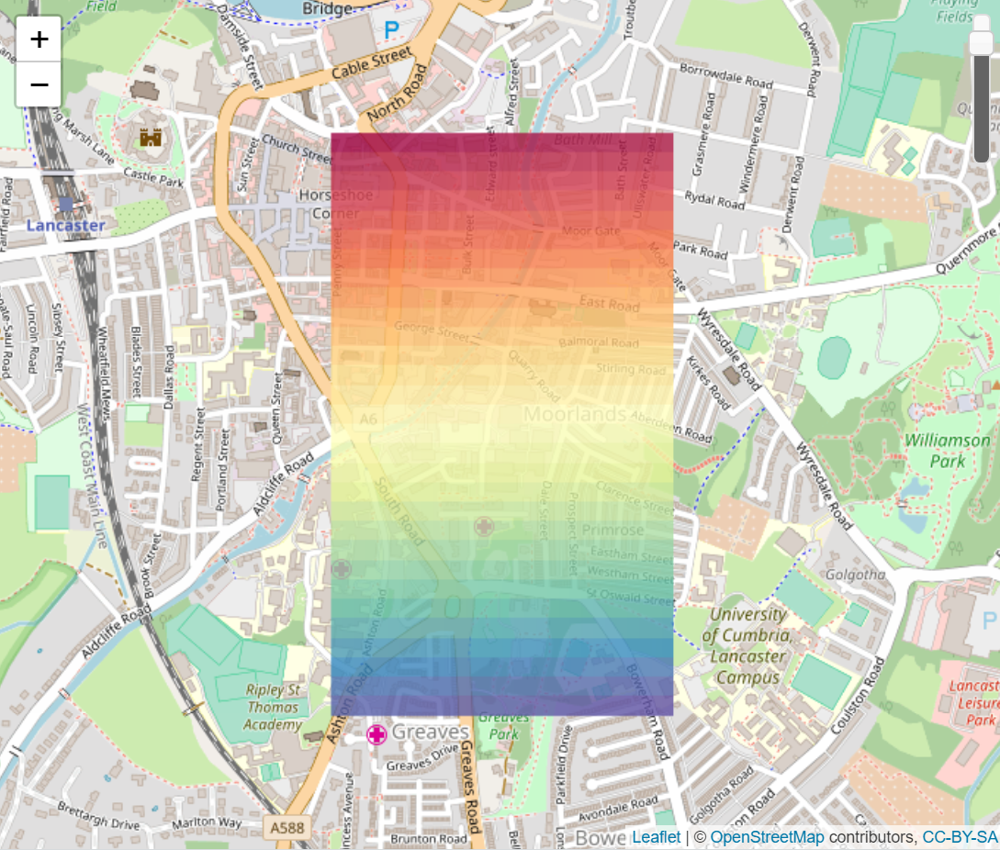

```{r setup, include = FALSE}
knitr::opts_chunk$set(
  collapse = TRUE,
  comment = "#>"
)
```

# General

**leaflet.opacity** extends the **leaflet** R package with the **Leaflet.OpacityControls** JavaScript plugin [@lizardtech_leaflet.opacitycontrols_2013]. It offers control buttons and a slider for adjusting the opacity of a layer. 

# Tutorial

This tutorial requires the following packages.

```{r, eval=FALSE}
library(leaflet)
library(leaflet.opacity)
library(raster)
```

To demonstrate leaflet.opacity an artificial raster layer is created with the **raster** R package.

```{r, eval=FALSE}
r <- raster(xmn = -2.8, xmx = -2.79, ymn = 54.04, ymx = 54.05, nrows = 30, ncols = 30)
values(r) <- matrix(1:900, nrow(r), ncol(r), byrow = TRUE)
crs(r) <- CRS("+init=epsg:4326")
```

The three functions `addLowerOpacity`, `addHigherOpacity` and `addOpacitySlider` add a new control to the leaflet map. They can be used like all leaflet functions together with the `%>%` operator. 

```{r, eval=FALSE}
leaflet() %>%
    addTiles() %>%
    addRasterImage(r, layerId = "raster") %>%
    addOpacitySlider(layerId = "raster")
```

In this example a leaflet map is created with background tiles and the previously created raster layer `r` is added. The function `addOpacitySlider` adds the opacity slider to the map. The `layerId` defines which layer's opacity is controlled by the slider. 

{width=400px}

# References
